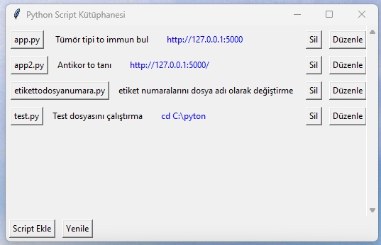

# myPythons
Python Script Yöneticisi
Python scriptlerinizi kolayca yönetebileceğiniz, açıklamalar ve linklerle zenginleştirebileceğiniz bir uygulama.

## Özellikler

- **Script Ekleme ve Düzenleme:** Farklı klasörlerde bulunan Python scriptlerinizi ekleyebilir, açıklamalarını ve linklerini belirleyebilirsiniz.
- **Scriptleri Çalıştırma:** Liste üzerindeki bir script butonuna tıklayarak scripti çalıştırabilirsiniz.
- **Açıklamalar ve Linkler:**
  - **Açıklama:** Script hakkında bilgi sağlayan metin. Tıklanamaz, normal metin olarak görüntülenir.
  - **Link:** İsteğe bağlı olarak ekleyebileceğiniz bir web sayfası linki. Mavi renkli ve tıklanabilir. Tıklandığında varsayılan tarayıcınızda açılır.
- **Scriptleri Silme:** Eklediğiniz scriptleri listeden kaldırabilirsiniz.
- **Yapılandırmanın Kaydedilmesi:** Eklediğiniz scriptler bir yapılandırma dosyasında (`scripts_config.json`) saklanır, böylece uygulamayı kapatıp açtığınızda liste aynı kalır.

## Gereksinimler

- Python 3.x
- Standart kütüphaneler:
  - `tkinter`
  - `subprocess`
  - `json`
  - `os`
  - `webbrowser`

## Kurulum

1. **Depoyu Klonlayın veya İndirin:**

   ```bash
   git clone https://github.com/kullaniciadi/projeadi.git
   ```

2. **Gerekli Kütüphaneleri Yükleyin:**

   Uygulama standart kütüphaneleri kullandığı için ek bir yükleme yapmanıza gerek yoktur.

## Kullanım

1. **Uygulamayı Başlatın:**

   Terminal veya komut isteminde aşağıdaki komutu çalıştırın:

   ```bash
   python script_manager.py
   ```

   Alternatif olarak, `script_manager.py` dosyasına çift tıklayarak da uygulamayı başlatabilirsiniz.

2. **Script Ekleme:**

   - **Script Ekle** butonuna tıklayın.
   - Açılan pencerede:
     - **Script Dosyası:** Eklemek istediğiniz Python scriptini seçin.
     - **Açıklama:** Script hakkında bir açıklama girin.
     - **Link:** İsteğe bağlı olarak bir web sayfası linki girebilirsiniz.
   - **Kaydet** butonuna tıklayarak scripti listeye ekleyin.

3. **Scriptleri Görüntüleme ve Çalıştırma:**

   - **Script Adı Butonu:** Scriptin adını taşıyan bu butona tıklayarak scripti çalıştırabilirsiniz.
   - **Açıklama Metni:** Açıklama normal bir metin olarak görüntülenir ve tıklanamaz.
   - **Link (Eğer Varsa):** Link mavi renkli ve tıklanabilir bir metin olarak gösterilir. Tıkladığınızda varsayılan tarayıcınızda web sayfası açılır.

4. **Scriptleri Düzenleme ve Silme:**

   - **Düzenle:** Scriptin yanındaki **Düzenle** butonuna tıklayarak script bilgilerini güncelleyebilirsiniz.
   - **Sil:** Scriptin yanındaki **Sil** butonuna tıklayarak scripti listeden kaldırabilirsiniz.

## Örnek Ekran Görüntüsü



## Yapılandırma Dosyası

Uygulama, eklediğiniz scriptleri ve bilgilerini `scripts_config.json` adlı bir dosyada saklar. Bu dosya, uygulamayı kapatıp açtığınızda scriptlerinizin kaybolmamasını sağlar.

## Katkıda Bulunma

1. Bu projeyi fork edin.
2. Yeni bir dal (branch) oluşturun:

   ```bash
   git checkout -b ozellik/yeniozellik
   ```

3. Değişikliklerinizi commit edin:

   ```bash
   git commit -m "Yeni özellik eklendi"
   ```

4. Dalınızı gönderin:

   ```bash
   git push origin ozellik/yeniozellik
   ```

5. Bir Pull Request oluşturun.

## Lisans

Bu proje MIT lisansı ile lisanslanmıştır. Daha fazla bilgi için `LICENSE` dosyasına bakın.
